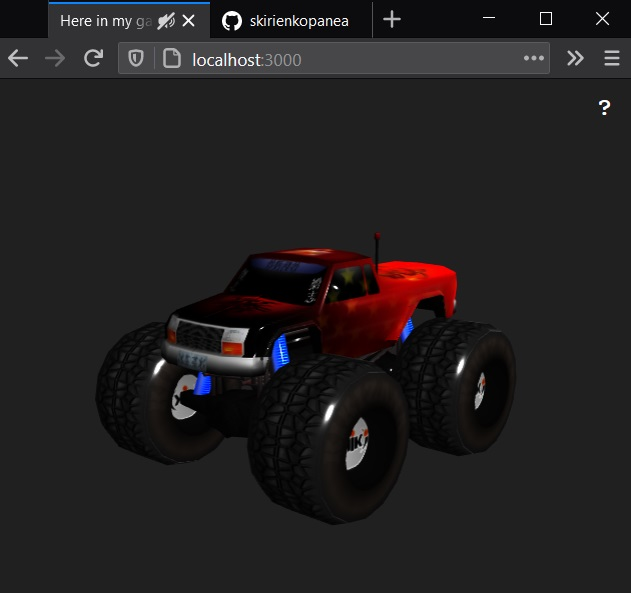
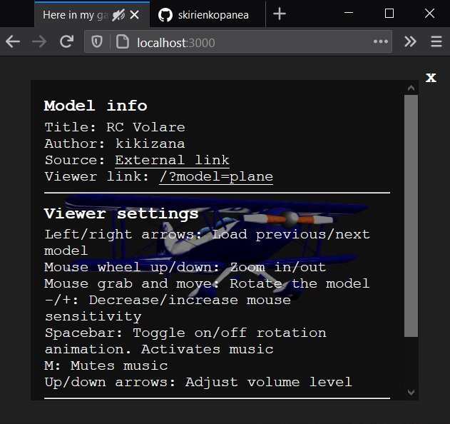

Simple 3D model viewer based on https://github.com/mrdoob/three.js/ 3D library and suited for Sketchfab GLTF files.
<ul>
  <li>The viewer is responsive to screen size changes (window fit). Designed to be easily embedded.</li>
  <li>Free sample models from https://sketchfab.com/kikizana, "elevator song": Local Forecast - Slower, by Kevin Macleod https://incompetech.com/music/royalty-free/</li>
  <li>The only visible GUI is an interrogation mark in the top right corner, which upon clicking displays a window with the model info and viewer settings (see screenshots).</li>
    <li>The viewer supports GLTF 3D files. Especially those from Sketchfab. You can easily import models into the viewer by extracting the downloaded zipfile from sketchab into a custom folder in /public/models/&lt;your model folder&gt;. Now you can directly view the model from any url that has the model paramater equal to the model folder, i.e http://localhost:3000/?model=toy for 'toy' folder</li>
    <li>All models in /public/models directory will be acessible through the Left/Right arrow keys in asccending alphabetic order.</li>
  <li>Live implementation at https://sergio.kpan.nl:4001/ (shows a random model) or to see it embedded in a blog post you can check https://skirienkopanea.github.io/node/2021/01/30/3d-model-viewer.html.
</ul>
Screenshots:




You can implement this 3D model viewer on your local machine. Install Node.js https://nodejs.org/en/ and git https://git-scm.com/. Then execute the following on the terminal:

```console
git clone https://github.com/skirienkopanea/3d
cd 3d
npm install
npm start
```

You can now access the 3D model viewer at http://localhost:3000/

Improvement points:
<ul>
  <li>Improve lighting</li>
</ul>
